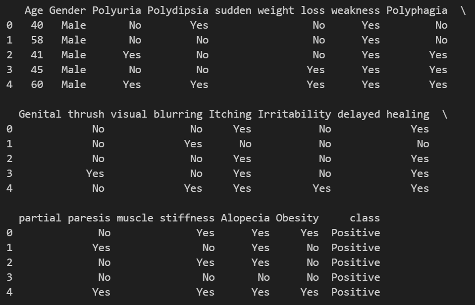

## 1. 数据集介绍

**该数据集包含新患糖尿病或可能成为糖尿病患者的体征和症状数据。**

1. **标签为类型**：正类 / 负类

2. **数据集数量**：520

3. **特征数量**：16

   **如下：**

   - **Age** 1.20-65
   - **Sex** 1. Male, 2.Female
   - **Polyuria** 1.Yes, 2.No.
   - **Polydipsia** 1.Yes, 2.No.
   - **sudden weight** loss 1.Yes, 2.No.
   - **weakness** 1.Yes, 2.No.
   - **Polyphagia** 1.Yes, 2.No.
   - **Genital thrush** 1.Yes, 2.No.
   - **visual blurring** 1.Yes, 2.No.
   - **Itching** 1.Yes, 2.No.
   - **Irritability** 1.Yes, 2.No.
   - **delayed healing** 1.Yes, 2.No.
   - **partial paresis** 1.Yes, 2.No.
   - **muscle stiness** 1.Yes, 2.No.
   - **Alopecia** 1.Yes, 2.No.
   - **Obesity** 1.Yes, 2.No.
   - **Class** 1.Positive, 2.Negative.

4. **行为数据实例；列为特征**

## 2. 数据集展示

```python
import pandas as pd

cd = os.getcwd()
file = ""
file_path = os.path.join(cd,file)
data = pd.read_csv(file_path)

print(data.head())

```



## 3. 数据集来源

[https://archive.ics.uci.edu/dataset/529/early+stage+diabetes+risk+prediction+dataset](https://archive.ics.uci.edu/dataset/529/early+stage+diabetes+risk+prediction+dataset)


## 4.该预测模型分为两个模型板块分别是随机森林模型和SVM模型。 
## View.py是可视化程序负责各个特征标签和目标标签的直方图展示，也可以理解为相关性的可视化，但是反映的单一变量。
## View2.py则是相关性的热力图可视化